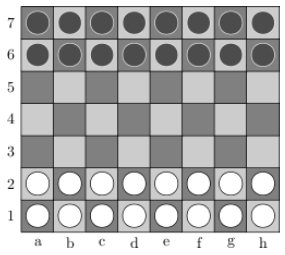

# Nard

První zmínka o Latrunculi (celým názvem Ludus Latrunculorum) pochází z prvního století před naším letopočtem. Hra je ale pravděpodobně mnohem starší. Jedná se o starořímskou hru, jejím předchůdcem jsou pravděpodobně starořecké hry Petteia a Penta Grammai. Peršané hráli stejnou hru pod názvem Nard. My jí budeme říkat Nard, protože je to kratší a zní to drsně.



_Hrací plocha (obrázek 1)_

## Popis hry

### Cíl hry

- Vyřadit ze hry co nejvíce soupeřových kamenů.

### Výchozí situace

- Na začátku hry stojí všechny kameny proti sobě v krajních řadách desky 8x7 (viz obrázek 1).

### Pravidla hry

- Kameny se pohybují ortogonálně o jedno pole.
- Kameny se nemohou přeskakovat.
- Soupeřův kámen může být zajat tak, že je obstoupen 2 kameny v jednom směru nebo je
uzavřen v rohu dvěma cizími kameny.
- Jedním tahem lze zajmout i více kamenů najednou.
- Jestliže kámen dobrovolně vstoupí mezi dva cizí kameny, není zajat.

### Konec hry

- Hra končí, jestliže jeden z hráčů ztratí všechny své kameny nebo se hráči dostanou do situace, kdy ani jeden hráčů není schopen během 30 tahů zajmout cizí kámen.
- Vítězem je hráč, kterému na desce zbylo více kamenů.

### Dokumenty ke stažení

[Projektový seminář 1 (.docx)](docs/projektovy_seminar1_informace.docx)

[Implementace (.docx)](docs/implementace_informace_o_vyvoji_programu.docx)

## Plán

```
To be written
```

